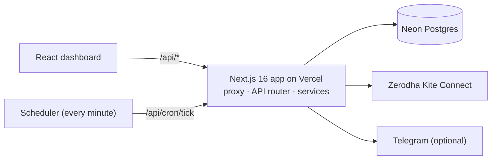

# Algo Hunt — documentation

Algo Hunt is a real-time **trading alert platform** for Indian derivatives. It watches futures and ATM options of
**NSE/BSE indices** (NIFTY, BANKNIFTY, FINNIFTY, SENSEX, BANKEX) and **MCX commodities** (Gold, Silver, Crude Oil,
Natural Gas, base metals). It evaluates a strategy on every **closed candle** from Zerodha Kite and raises one
combined alert when the strategy's rules turn true. It never places trades.

- **Strategies:** the built-in *RSI Multi Confirmation* (Future ≥ 60, Call ≥ 60, Put ≤ 40 with two scenarios), or
  your own rules from a no-code builder. The builder offers 13 indicator types, Chartink-style operators, several
  timeframes per strategy (incl. Daily/Weekly), Heikin Ashi candles and candlestick patterns.
- **Live monitoring** on Vercel serverless, driven by a per-minute scheduler, with alerts to the dashboard, browser
  notifications and optionally Telegram.
- **Backtesting** replays the same engine on Kite historical candles.

## Documentation map

| Page | What's inside |
| --- | --- |
| [architecture.md](architecture.md) | Components, runtime model, request / live-evaluation flows, frontend–backend interaction, integrations, authentication, key decisions (with diagrams) |
| [domain.md](domain.md) | The business logic: markets & sessions, contracts & expiries, strategies, indicators, operators, multi-timeframe rules, monitors, alerts, backtesting, UI map, glossary |
| [setup.md](setup.md) | Prerequisites, installation, environment variables, local run, Kite login, common setup problems |
| [development.md](development.md) | Repository structure, coding & naming conventions, UI rules, how-to recipes (endpoint, page, indicator, schema change…) |
| [api.md](api.md) | Every REST endpoint with parameters, bodies, responses, status codes and examples |
| [database.md](database.md) | Schema (ER diagram), tables, indexes, migrations, seed data, access patterns |
| [testing.md](testing.md) | vitest setup, what each suite covers, how to run tests, limitations |
| [deployment.md](deployment.md) | Vercel + Neon deployment, build, env vars, scheduler window, migrations, rollback, daily operations |
| [troubleshooting.md](troubleshooting.md) | Problems and exact error messages, with fixes |
| [code-notes.md](code-notes.md) | The complex parts of the code and recommended inline documentation |
| [status.md](status.md) | **Current state:** open issues to correct, limitations, deferred work, decisions log, verification status |

## Quick start

```bash
npm install
cp .env.example .env.local      # set DATABASE_URL (use a dev database!), KITE_API_KEY, KITE_API_SECRET
npm run dev                     # applies migrations, then http://localhost:3000
```

Then open the app → **Connect Kite** (the instrument master syncs automatically). Create a monitor under
**Configuration** (NSE/BSE) or **MCX → Monitors**, and click **Activate**. Full details:
[setup.md](setup.md).

```bash
npm test            # 127 tests
npm run typecheck   # tsc --noEmit
npm run build       # migrations (if DATABASE_URL is set) + next build
```

## Architecture at a glance



One Next.js app serves the UI and the API. A scheduler calls `/api/cron/tick` every minute. Each tick fetches
closed candles from Kite for every active monitor whose market is open, and runs them through the same engine the
backtester uses. Alerts are stored in Postgres, where unique indexes guarantee at most one per candle. See
[architecture.md](architecture.md).

## Important developer resources

- [AGENTS.md](../AGENTS.md) — **Next.js 16 differs from older versions**; read `node_modules/next/dist/docs/` before
  writing Next.js code.
- [.env.example](../.env.example) — environment template.
- [src/server/api/routes.ts](../src/server/api/routes.ts) — the full API route table.
- [src/shared/constants.ts](../src/shared/constants.ts) — underlyings, MCX products, timeframes.
- [src/server/services/indicator/registry.ts](../src/server/services/indicator/registry.ts) and
  [builderCatalog.ts](../src/server/services/strategy/builderCatalog.ts) — indicator and operator catalog.
- [src/client/lib/help.ts](../src/client/lib/help.ts) — all tooltip text (every control must have one).
- [Root README](../README.md) — original project overview (parts predate MCX; these docs take precedence).
