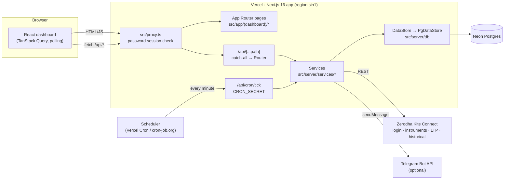
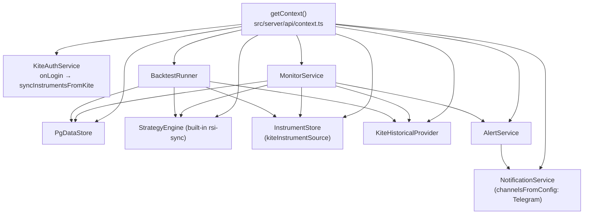
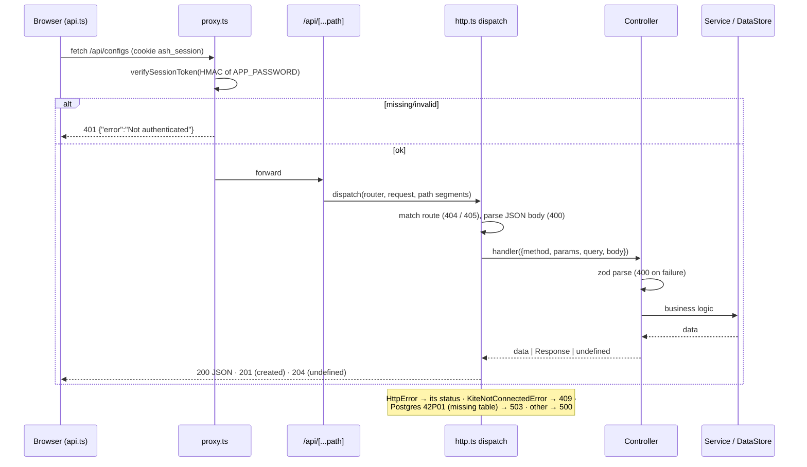
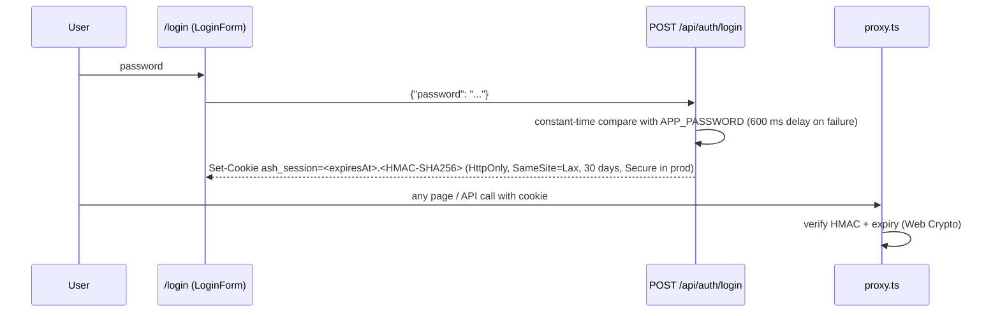
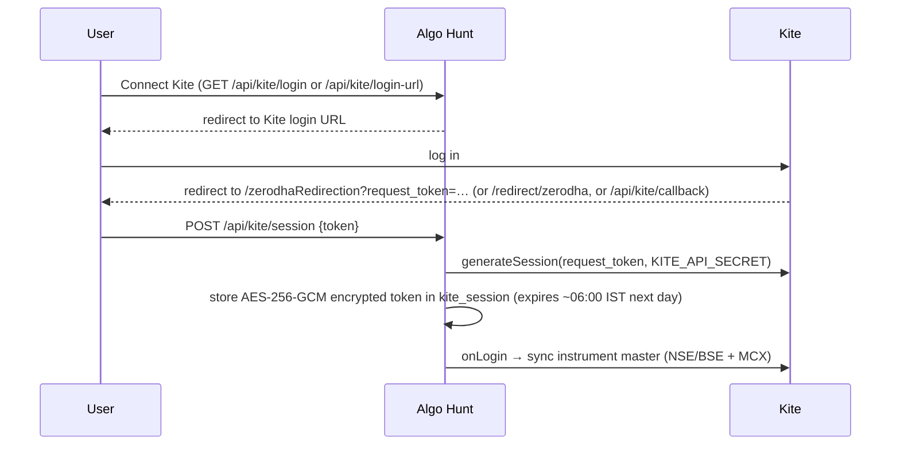

# Architecture

Algo Hunt is a single **Next.js 16 (App Router)** application that serves the React dashboard and a JSON REST API
from the same deployment. It is built to run **serverless on Vercel**: nothing stays running between requests, so
live monitoring is driven by a per-minute scheduler instead of a WebSocket ticker. All state lives in **Postgres
(Neon)**; all market data comes from **Zerodha Kite Connect**.

> Related: [domain.md](domain.md) (what the system computes) · [api.md](api.md) · [database.md](database.md) ·
> [deployment.md](deployment.md)

---

## 1. High-level view



| Layer | Location | Responsibility |
| --- | --- | --- |
| Access control | [src/proxy.ts](../src/proxy.ts) | Next.js 16 "proxy" (formerly middleware): every page and `/api/*` needs the password session cookie, except `/login`, `/api/auth/login`, `/api/health` and `/api/cron/*` |
| Pages | [src/app/](../src/app) | Thin route files that render client views from `src/client/views` |
| REST API | [src/app/api/[...path]/route.ts](../src/app/api/[...path]/route.ts) → [src/server/api/](../src/server/api) | One catch-all route dispatches to a small path router, controllers and zod schemas |
| Scheduler entry | [src/app/api/cron/tick/route.ts](../src/app/api/cron/tick/route.ts) | Runs one live-evaluation pass (`runLiveTick`) |
| Services | [src/server/services/](../src/server/services) | Kite integration, live monitoring, strategy engine, indicators, backtesting, alerts, notifications, MCX catalog |
| Persistence | [src/server/db/](../src/server/db) | Repository interfaces (`DataStore`) and the Postgres implementation |
| Shared | [src/shared/](../src/shared) (alias `@ash/shared`) | Types, constants and market-profile rules used by both server and client |
| Client | [src/client/](../src/client) | React views, components, API client, tooltip text, theme |

---

## 2. Runtime model: serverless, candle-close evaluation

- **No long-running process.** Vercel functions are request-scoped. Everything the old worker kept in memory is now
  in Postgres: the Kite session (`kite_session`), monitor cursors and snapshots (`monitor_state`), leases
  (`app_locks`) and small key/values (`app_kv`).
- **Candles, not ticks.** Each evaluation pulls OHLCV candles from Kite's historical API and evaluates only
  **closed** candles. The still-forming candle feeds dashboard gauges only.
- **Per-minute trigger.** An external scheduler calls `/api/cron/tick` every minute during market hours. As a
  fallback, an open dashboard also calls `POST /api/live/tick` every 30 s while a market with active monitors is
  open. A database lease makes concurrent or back-to-back calls a no-op.
- **One engine for live and backtest.** The monitor service and the backtest runner call the same RSI calculator,
  the same built-in strategy class and the same generic custom-strategy evaluator, so historical and live results
  agree.
- **Dependency container.** [src/server/api/context.ts](../src/server/api/context.ts) is the only place services are
  wired together. It is built lazily once per serverless instance and cached on `globalThis`.



---

## 3. Request / response flow (REST API)



Details: [api.md](api.md). The client wrapper [src/client/lib/api.ts](../src/client/lib/api.ts) turns non-2xx
responses into `Error(body.error)` and redirects to `/login?next=…` on 401.

---

## 4. Live monitoring flow (one scheduler tick)

```mermaid
sequenceDiagram
  participant SCH as Scheduler / open dashboard
  participant T as runLiveTick (liveTick.ts)
  participant L as app_locks
  participant IS as instrumentSync
  participant M as MonitorService.runAll
  participant K as Kite historical API
  participant E as Evaluators (rsi-sync / custom)
  participant A as AlertService
  participant N as Telegram
  SCH->>T: GET /api/cron/tick (Bearer CRON_SECRET)
  T->>T: Kite connected? any market window open (NSE or MCX)?
  T->>L: acquire('live-tick', lease 280 s, min interval 45 s)
  T->>IS: syncInstrumentsIfStale (per market, 18 h max age)
  T->>M: runAll(now) — only monitors whose market is in session
  loop each active monitor
    M->>M: re-sync with strategy market profile; re-activate if expired
    M->>K: candles per leg (cached per token+timeframe within the run)
    M->>E: replay closed candles (warm-up + new)
    E-->>M: match on rising edge
    M->>A: record alert (deduped by unique index)
    A->>N: notify (logged in notification_logs)
    M->>M: store cursor + RSI snapshot in monitor_state
  end
  T->>L: release (sets last_run_at)
  T-->>SCH: {ran, monitors, alerts}
```

Correctness guarantees and their mechanics are described in [domain.md § Monitors](domain.md#6-monitors-live-evaluation).

---

## 5. Frontend / backend interaction

- **Data fetching:** TanStack Query ([src/app/providers.tsx](../src/app/providers.tsx): `staleTime` 10 s,
  `retry` 1, no refetch on focus). All calls go through `api` in [src/client/lib/api.ts](../src/client/lib/api.ts).
- **Live updates by polling** ([src/client/context/LiveContext.tsx](../src/client/context/LiveContext.tsx)):

  | What | Interval |
  | --- | --- |
  | `GET /live/status` (sessions, Kite, active monitors, last run) | 20 s |
  | `GET /alerts?limit=25` (new-alert detection → browser notification + chime) | 10 s (also in background tabs) |
  | `POST /live/tick` (dashboard-driven evaluation fallback) | 30 s, only while a market with active monitors is open and Kite is connected |
  | `GET /configs/snapshots` (monitor gauges) | 15 s on Dashboard / MCX / Configuration |
  | `GET /kite/status` | 30 s + on window focus |

- **Theme:** light by default; stored in `localStorage` and in `user_preferences.prefs.theme`
  ([src/client/theme/](../src/client/theme)). An inline script in the root layout applies a stored theme before
  first paint.
- **URL state:** tabs are query parameters (`/strategies?tab=builder&id=…`, `/mcx?tab=backtest&strategy=…`,
  `/alerts?view=table&segment=MCX`). Components that read `useSearchParams` are wrapped in `<Suspense>`.

---

## 6. Database interaction

- Services depend only on the repository interfaces in [src/server/db/store.ts](../src/server/db/store.ts)
  (`DataStore` with `alerts`, `configs`, `strategies`, `groups`, `monitors`, `kite`, `instruments`, `locks`, `kv`,
  `notifications`, `preferences`).
- [src/server/db/pg/pgStore.ts](../src/server/db/pg/pgStore.ts) implements them with raw SQL through one `pg.Pool`
  ([src/server/db/pool.ts](../src/server/db/pool.ts): `max` 5, idle timeout 10 s, TLS for non-local hosts, cached
  on `globalThis`).
- Tests use an in-process fake store ([tests/helpers/fixtures.ts](../tests/helpers/fixtures.ts)), never Postgres.

Details: [database.md](database.md).

---

## 7. External integrations

| Integration | Used for | Code |
| --- | --- | --- |
| **Zerodha Kite Connect** (`kiteconnect` npm package) | Login (request_token → access_token), instrument master (`getInstruments('NFO'/'BFO'/'MCX')`), LTP for ATM strikes (`getLTP`), historical candles (`getHistoricalData`, with OI; `continuous` for futures day candles), logout (`invalidateAccessToken`) | [src/server/services/kite/](../src/server/services/kite) |
| **Neon Postgres** | All persistent state | [src/server/db/](../src/server/db) |
| **Telegram Bot API** | Optional server-side alert delivery (`POST https://api.telegram.org/bot<token>/sendMessage`) | [NotificationService.ts](../src/server/services/notification/NotificationService.ts) |
| **Browser Notification API + Web Audio** | Desktop notification and chime for new alerts while the app is open | [src/client/lib/notify.ts](../src/client/lib/notify.ts) |

Kite call hygiene: 30 s request timeout; historical requests are serialized per instance with ≥ 350 ms spacing and
retried on HTTP 429; other REST calls retry on 429 with linear back-off (`withKiteRetry`).

---

## 8. Authentication and authorization

There are three independent mechanisms. There are **no user roles**: the app is single-tenant (one fixed default
user, `DEFAULT_USER_ID` in [src/server/db/constants.ts](../src/server/db/constants.ts)).

### 8.1 Dashboard password (people)



- With `APP_PASSWORD` unset the app is **open in development** and **refused (503) in production**.
- Changing `APP_PASSWORD` invalidates every session. Logout (`POST /api/auth/logout`) clears the cookie.

### 8.2 Scheduler secret (machines)

`/api/cron/tick` bypasses the proxy and checks `Authorization: Bearer $CRON_SECRET` or `?secret=$CRON_SECRET`
(constant-time). Without `CRON_SECRET` it is allowed only when `NODE_ENV !== 'production'`.

### 8.3 Kite Connect session (broker)



- The token is encrypted with a key derived from `KITE_API_SECRET` (SHA-256), never returned by any endpoint, and
  memoized per instance for 30 s.
- A Kite `TokenException` on any call flips the session to `needs-login`, and the UI shows **Connect Kite**.
- Duplicate submissions of the same `request_token` are de-duplicated per instance; a concurrent second exchange
  that fails shortly after a successful one is ignored.

---

## 9. Important architectural decisions

| Decision | Why | Where |
| --- | --- | --- |
| Vercel-only, cron-driven evaluation (no WebSocket worker) | Simplest possible deploy; the owner chose Vercel only | `liveTick.ts`, `/api/cron/tick` |
| Decide only on **closed** candles fetched from Kite | No repainting; RSI matches the Kite chart exactly | `monitorService.ts` |
| Same engine for live and backtest | Backtests predict live behaviour | `customEvaluator.ts`, `backtestRunner.ts` |
| Strategies are **JSON**, interpreted by a generic evaluator | No-code builder; versionable; the built-in strategy is proven equivalent in tests | `src/shared/types/builder.ts`, `customEvaluator.ts` |
| Strategy **market profile** (fixed vs open fields) | One strategy can be "specific" or "universal"; the server enforces fixed fields | `src/shared/strategyMarket.ts`, `runContext.ts` |
| **Two markets (segments)**: NSE/BSE index F&O and MCX commodities, with a dedicated MCX tab but a shared engine | MCX has different hours, monthly-only expiries and futures-only products; sharing the engine avoids duplicate indicator/strategy logic | `marketTime.ts`, `instrumentStore.ts`, `instrumentSync.ts`, `src/client/views/mcx/` |
| Per-market instrument sync that replaces only its own exchanges | One market's refresh or failure never wipes the other's contracts | `instrumentSync.ts`, `replaceExchanges` |
| Multi-timeframe conditions read the **still-forming** higher-timeframe candle built from closed run candles | Chartink-like behaviour without look-ahead | `customEvaluator.ts` |
| Single-tenant v1 | Personal tool; multi-user is noted as a roadmap item in code | `src/server/db/constants.ts` |
| Every UI control has a rich tooltip; fixed trader color language | Owner requirement (see [development.md § UI conventions](development.md#6-ui-conventions)) | `src/client/lib/help.ts`, `src/client/lib/signals.ts` |
