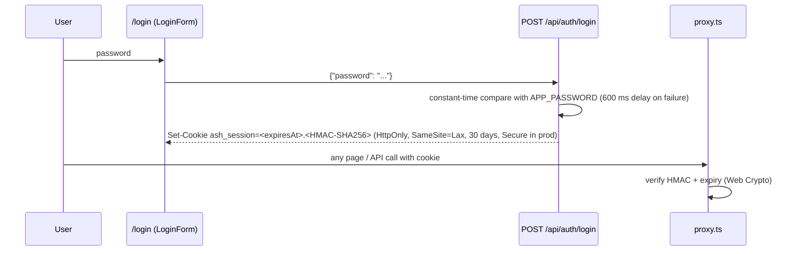
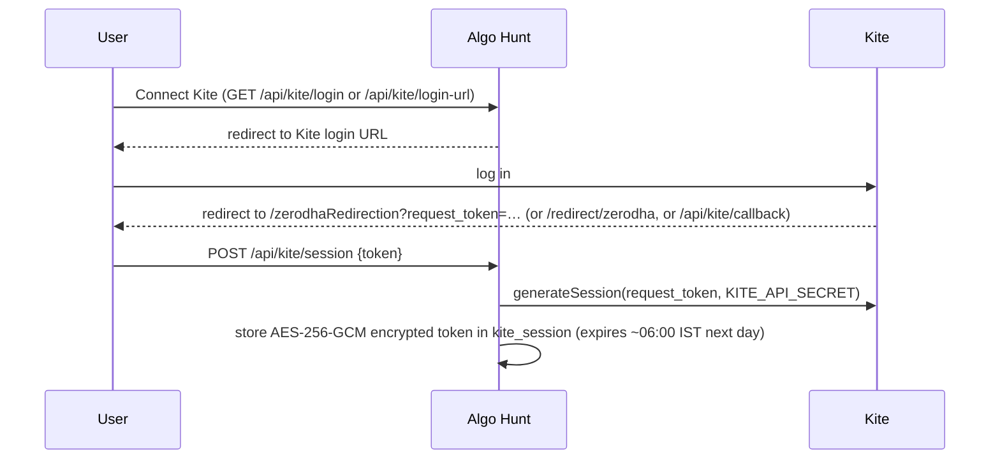

# Architecture

> Related: [v2-architecture.md](v2-architecture.md) (the strategy system in depth) · [api.md](api.md) ·
> [database.md](database.md) · [deployment.md](deployment.md)

Algo Hunt is a personal **alerting** platform (it never places orders): build a strategy once, connect it to any NSE
index, NSE stock or MCX commodity, and get Telegram / email / desktop alerts when it fires. Everything runs on real
Zerodha Kite data.

## 1. High-level view

```
Browser (React 19, TanStack Query)
  /v2        V2 hub: Dashboard · Strategies · Connections · Compare · Alerts · Products · Scanner · Settings
  /settings  Kite login, theme, desktop notifications
      │  fetch /api/*  (session cookie, checked by src/proxy.ts)
      ▼
Next.js 16 app (Node runtime; Vercel or local)
  /api/[...path]   router → controllers: health · kite · preferences · v2
  /api/cron/tick   V2 scanner cycle (CRON_SECRET), the backup to the live worker
  /api/auth/*      password login / logout
      │                                   │
      ▼                                   ▼
Neon Postgres  ◄─────────────────  Live worker (`npm run live`, your computer)
  v2_* tables, kite_session,         Kite WebSocket → candles → evaluate at every close
  user_preferences, app_locks        → verify on Kite candles → alert
      ▲                                   │
      └──── Kite Connect (historical candles, LTP, instrument dumps, WebSocket ticks)
```

| Layer | Where | Notes |
| --- | --- | --- |
| Pages | [src/app/](../src/app) | `(dashboard)/v2`, `(dashboard)/settings`, `login`, Kite redirect landings (`/zerodhaRedirection`, `/redirect/zerodha`). `/` and every retired page URL redirect to `/v2` ([next.config.ts](../next.config.ts)) |
| App shell | [src/client/components/layout/](../src/client/components/layout) | Sidebar (V2, Settings), top bar (Kite status, NSE/BSE + MCX sessions, live feed vs scanner, notifications, theme, sign out), `AlertNotifier` (desktop notification + chime for new V2 alerts) |
| V2 UI | [src/client/v2/](../src/client/v2) | Everything strategy-related |
| API | [src/server/api/](../src/server/api) | Thin router + controllers; wiring in [context.ts](../src/server/api/context.ts) |
| V2 module | [src/server/v2/](../src/server/v2) | Products, strategies, connections, engine, alerts, scanner, compare, live worker |
| Shared low-level | [src/server/services/](../src/server/services) | `kite/` (auth + encrypted session, client, historical candles with the ~3 req/s gate) and `indicator/` (indicator maths V2's engine uses) |
| Utilities | [src/server/utils/](../src/server/utils), [src/server/config/](../src/server/config), [src/server/db/](../src/server/db) | IST / session helpers, env config, pool, app store (Kite session + preferences) |

## 2. How alerts are produced

- **Live worker (preferred):** `npm run live` on your computer streams Kite ticks for every contract the switched-on
  connections use and evaluates each connection ~2.5 s after its trigger candle closes; anything that would alert
  (or is a near miss that matters, or has a data gap) is re-checked on Kite's official candles first. See
  [v2-architecture.md § 4b](v2-architecture.md#4b-live-worker-streaming--npm-run-live).
- **Scanner (backup):** `/api/cron/tick`, called every minute by Vercel Cron or cron-job.org (and while `/v2` is
  open), fetches closed candles from Kite and evaluates due connections. While the live worker's heartbeat is fresh
  it only checks connections the worker can't cover; when the worker goes silent it takes over and warns once on
  Telegram.
- Both use the same engine, alert policy and dedupe (signal identity), so a candle never alerts twice.

## 3. Request flow

`/api/*` → [src/proxy.ts](../src/proxy.ts) (session cookie) → [src/app/api/[...path]/route.ts](../src/app/api/[...path]/route.ts)
→ `createRouter(getContext())` ([routes.ts](../src/server/api/routes.ts)) → controller → `V2Service` / `KiteAuthService`
/ app store → JSON. Errors map to status codes in [http.ts](../src/server/api/http.ts) (400 validation, 401, 404,
409 Kite not connected, 503 missing tables).

## 4. External integrations

| Service | Used for | Where |
| --- | --- | --- |
| Zerodha Kite Connect | Login (daily token), instrument dumps (NSE, BSE, NFO, BFO, MCX), historical candles, LTP / quotes, WebSocket ticks | [services/kite/](../src/server/services/kite), [v2/data/KiteDataProvider.ts](../src/server/v2/data/KiteDataProvider.ts), [v2/live/KiteStream.ts](../src/server/v2/live/KiteStream.ts) |
| Telegram Bot API | Alerts and live-worker health messages | [v2/alerts/notifications.ts](../src/server/v2/alerts/notifications.ts) |
| Resend | Email alerts | same |
| Neon Postgres | All state | [database.md](database.md) |

## 5. Authentication and authorization

There are three independent mechanisms. There are **no user roles**: the app is single-user (one seeded default user holds the UI preferences).

### 5.1 Dashboard password (people)


```mermaid
sequenceDiagram
  participant U as User
  participant L as /login (LoginForm)
  participant A as POST /api/auth/login
  participant P as proxy.ts
  U->>L: password
  L->>A: {"password": "..."}
  A->>A: constant-time compare with APP_PASSWORD (600 ms delay on failure)
  A-->>L: Set-Cookie ash_session=<expiresAt>.<HMAC-SHA256> (HttpOnly, SameSite=Lax, 30 days, Secure in prod)
  U->>P: any page / API call with cookie
  P->>P: verify HMAC + expiry (Web Crypto)
```

- With `APP_PASSWORD` unset the app is **open in development** and **refused (503) in production**.
- Changing `APP_PASSWORD` invalidates every session. Logout (`POST /api/auth/logout`) clears the cookie.

### 5.2 Scheduler secret (machines)

`/api/cron/tick` bypasses the proxy and checks `Authorization: Bearer $CRON_SECRET` or `?secret=$CRON_SECRET`
(constant-time). Without `CRON_SECRET` it is allowed only when `NODE_ENV !== 'production'`.

### 5.3 Kite Connect session (broker)


```mermaid
sequenceDiagram
  participant U as User
  participant App as Algo Hunt
  participant K as Kite
  U->>App: Connect Kite (GET /api/kite/login or /api/kite/login-url)
  App-->>U: redirect to Kite login URL
  U->>K: log in
  K-->>U: redirect to /zerodhaRedirection?request_token=… (or /redirect/zerodha, or /api/kite/callback)
  U->>App: POST /api/kite/session {token}
  App->>K: generateSession(request_token, KITE_API_SECRET)
  App->>App: store AES-256-GCM encrypted token in kite_session (expires ~06:00 IST next day)
```

- The token is encrypted with a key derived from `KITE_API_SECRET` (SHA-256), never returned by any endpoint, and
  memoized per instance for 30 s.
- A Kite `TokenException` on any call flips the session to `needs-login`, and the UI shows **Connect Kite**.
- Duplicate submissions of the same `request_token` are de-duplicated per instance; a concurrent second exchange
  that fails shortly after a successful one is ignored.

## 6. Decisions

| Decision | Why |
| --- | --- |
| V2 is the whole app; V1 pages and MCX V2 removed (2026-09-27), their tables kept | One product-agnostic system covers NSE and MCX; old data stays recoverable |
| Live worker on your computer + cron scanner as backup | Seconds-after-close alerts for many products (Kite's historical API allows ~3 requests/s); the backup keeps alerts flowing when the computer is off |
| Alerts only after Kite's official candles confirm (live worker) | "Correct" = matches the Kite/Zerodha chart candle |
| Every UI control has a rich tooltip; green/red only for direction | Owner requirement ([development.md](development.md)) |
