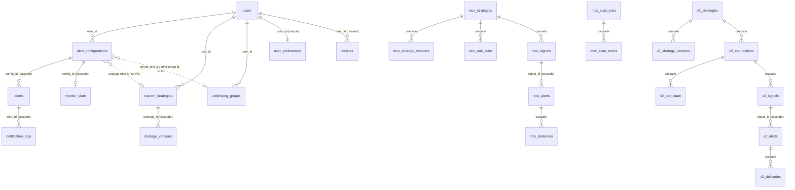

# Database

> Related: [architecture.md § 6](architecture.md#6-database-interaction) · [development.md § 5](development.md#change-the-database-schema) · [deployment.md](deployment.md)

## 1. Technology and access

| Item | Value |
| --- | --- |
| Engine | PostgreSQL. Production uses **Neon** (Singapore, `ap-southeast-1`; Vercel functions pinned to `sin1` in [vercel.json](../vercel.json)) |
| Driver | `pg` (node-postgres) — raw SQL, no ORM |
| Pool | [src/server/db/pool.ts](../src/server/db/pool.ts): `max` 5, `idleTimeoutMillis` 10 000, TLS (`rejectUnauthorized: false`) for every non-`localhost`/`127.0.0.1` host, cached on `globalThis` |
| Repositories | Interfaces in [src/server/db/store.ts](../src/server/db/store.ts); Postgres implementation in [src/server/db/pg/pgStore.ts](../src/server/db/pg/pgStore.ts) |
| Migrations | Plain SQL in [db/migrations/](../db/migrations), applied by [scripts/migrate.mjs](../scripts/migrate.mjs) |
| Tenancy | Single-tenant: every `user_id` is the fixed `DEFAULT_USER_ID` (`00000000-0000-0000-0000-000000000001`, [constants.ts](../src/server/db/constants.ts)) |

Required extension: `pgcrypto` (created by migration 001). `gen_random_uuid()` is used for defaults.

---

## 2. Entity relationships

Loose links (no foreign key): `alert_configurations.strategy` holds `'rsi-sync'` or a custom strategy UUID as text.
`alerts.strategy_id` is text. An alert's market is derived from `alerts.underlying` (MCX product symbols vs
everything else), so there is no segment column.

---

## 3. Tables

### `alert_configurations` — monitors (001, 003)

| Column | Type | Notes |
| --- | --- | --- |
| `id` | uuid PK | Generated in app (`randomUUID`) |
| `user_id` | uuid FK → users | Default user |
| `underlying` | text | e.g. `NIFTY`, `CRUDEOIL` |
| `expiry_type` | text | `current-weekly`, `next-weekly`, `monthly`, `near-month`, `next-month`, `far-month` |
| `expiry_date` | text | Resolved date (yyyy-mm-dd), set on activation |
| `strike_selection` | text | `ATM`, `ATM±1`, `ATM±2`, `CUSTOM` |
| `custom_strike` | numeric | Only for `CUSTOM` |
| `timeframe` | text | `1m`…`1h`, `1d`, `1w` |
| `strategy` | text | `rsi-sync` or custom strategy UUID |
| `params` | jsonb | `RsiSyncParams` `{rsiPeriod, futureLevel, callLevel, putLevel}` |
| `active` | boolean | Evaluated live when true |
| `group_id`, `group_name` | text | Set for group monitors (003) |
| `created_at`, `updated_at` | timestamptz | |

Indexes: `configs_active_idx (active)`, `configs_group_idx (group_id)`.

### `monitor_state` — live evaluation state per active monitor (004)

| Column | Type | Notes |
| --- | --- | --- |
| `config_id` | uuid PK, FK → alert_configurations (cascade) | |
| `strike` | numeric | Locked strike (0 for futures-only) |
| `expiry` | text | Locked expiry; re-activation happens when it has passed |
| `triplet` | jsonb | `{ future, call?, put?, strike }` — full `Instrument` objects |
| `activated_at` | timestamptz | Candles closing before this never alert |
| `last_bucket` | bigint | Cursor: open time (ms) of the last evaluated closed candle; only moves forward (`GREATEST`) |
| `snapshot` | jsonb | `{ legs: {future, call, put: {rsi, closedRsi, ltp, level}}, lastClosedBucket, evaluatedAt }` |
| `last_error` | text | Last evaluation error (shown in the UI) |
| `updated_at` | timestamptz | |

### `alerts` — strategy triggers (001, 002, 003, 004)

| Column | Type | Notes |
| --- | --- | --- |
| `id` | uuid PK | `gen_random_uuid()` |
| `config_id` | uuid FK → alert_configurations (cascade) | |
| `underlying`, `expiry`, `timeframe`, `strategy` | text | |
| `strike` | numeric | 0 for futures-only monitors |
| `scenario` | smallint, nullable (002) | 1/2 for the built-in strategy; NULL for custom strategies |
| `bucket` | bigint | Candle open time (ms) |
| `future_rsi`, `call_rsi`, `put_rsi` | numeric NOT NULL | RSI snapshot (best-effort for custom strategies — see [status.md](status.md)) |
| `future_prev_rsi`, `call_prev_rsi`, `put_prev_rsi` | numeric | |
| `title` | text | |
| `triggered_at` | timestamptz | Candle close time |
| `strategy_id`, `strategy_name`, `variant` | text (002) | Custom strategies |
| `conditions` | jsonb (002) | `ConditionTrace[]` — why it fired |
| `group_id`, `group_name` | text (003) | |
| `created_at` | timestamptz | |

Indexes:

| Index | Definition | Purpose |
| --- | --- | --- |
| `alerts_dedupe_idx` | UNIQUE `(config_id, bucket, scenario)` | One built-in alert per monitor, candle and scenario |
| `alerts_dedupe_custom_idx` | UNIQUE `(config_id, bucket) WHERE scenario IS NULL` | Same for custom alerts (NULLs are distinct in the first index) |
| `alerts_triggered_at_idx` | `(triggered_at DESC)` | History ordering |
| `alerts_underlying_idx`, `alerts_strategy_id_idx`, `alerts_group_idx`, `alerts_config_idx` | single columns | Filters |

Inserts use `ON CONFLICT DO NOTHING RETURNING *`: a duplicate returns no row, so nothing is notified.

### `custom_strategies` and `strategy_versions` (002)

| Table | Columns |
| --- | --- |
| `custom_strategies` | `id` uuid PK · `user_id` · `name` · `category` · `status` (`draft`/`active`/`disabled`) · `version` int · `definition` jsonb (the full `StrategyDef`, including `market` and the rule tree) · `created_at` · `updated_at` |
| `strategy_versions` | `id` · `strategy_id` FK (cascade) · `version` · `definition` jsonb · `created_at` · UNIQUE `(strategy_id, version)` |

`definition` is normalized on read (`normalizeStrategyDef`): legacy rows without `market` become universal.

### `underlying_groups` (003)

`id` uuid PK · `user_id` · `name` · `members` jsonb (array of symbols) · `created_at` · `updated_at`. The preset
**Indices** group (`group-indices`) is **not stored**; it is generated in code (`indicesGroup()`).

### `instruments` — Kite instrument master (004)

| Column | Type | Notes |
| --- | --- | --- |
| `token` | bigint PK | Kite instrument token |
| `tradingsymbol` | text | e.g. `NIFTY25OCTFUT`, `GOLD25DEC130000CE` |
| `underlying` | text | Our symbol (Kite `name`) |
| `exchange` | text | `NFO`, `BFO`, `MCX` |
| `instrument_type` | text | `FUT`, `CE`, `PE` |
| `strike` | numeric | 0 for futures |
| `expiry` | text | yyyy-mm-dd |
| `lot_size`, `tick_size` | int, numeric | |

Index: `instruments_underlying_idx (underlying, expiry)`. Replaced **per exchange set** in one transaction
(`replaceExchanges`: `DELETE … WHERE exchange = ANY($1)` then bulk `INSERT … SELECT * FROM unnest(...)` in
5000-row chunks).

### `kite_session` (004)

Single row (`id` smallint PK = 1, `CHECK (id = 1)`): `access_token` (AES-256-GCM encrypted,
`base64(iv).base64(tag).base64(ciphertext)`), `kite_user_id`, `user_name`, `login_time`, `expires_at`, `state`
(`needs-login`/`connected`/`error`), `last_error`, `updated_at`.

### `app_locks` and `app_kv` (004)

| Table | Columns | Used for |
| --- | --- | --- |
| `app_locks` | `name` PK · `locked_until` · `last_run_at` | Lease `live-tick`: acquired only if the previous lease expired **and** the last run ended ≥ `minIntervalSeconds` ago (single `INSERT … ON CONFLICT DO UPDATE … WHERE`) |
| `app_kv` | `key` PK · `value` jsonb · `updated_at` | Keys: `instruments_synced_at`, `instruments_synced_at_mcx` (`{at, count}`), `last_tick` (`{at, monitors, alerts, errors}`) |

### `notification_logs` (001)

`id` · `alert_id` FK (cascade) · `channel` (`telegram`; the type also reserves `browser`, `email`, `firebase`) ·
`status` (`sent`/`failed`) · `error` · `sent_at`.

### `users`, `user_preferences` (001, 004, 005)

- `users`: `id` · `email` (unique) · `name` · `created_at`. One seeded row.
- `user_preferences`: `id` · `user_id` (unique FK) · `prefs` jsonb `{theme, soundEnabled, browserNotifications}` ·
  `updated_at`.

### Unused tables

`devices` and `strategies` (both from 001) are **not referenced by application code**. The built-in strategy is
defined in code, not in `strategies`.

### `schema_migrations`

Created by `scripts/migrate.mjs`: `id` (file name) PK · `applied_at`.

---

### MCX V2 tables (006)

Owned by the isolated MCX V2 subsystem ([mcx-v2-architecture.md § 9](mcx-v2-architecture.md#9-persistence-model));
accessed only through [PgMcxStore](../src/server/mcx/persistence/PgMcxStore.ts). Numeric prices are
`DOUBLE PRECISION`; candle times are epoch seconds (`BIGINT`).

| Table | Purpose |
| --- | --- |
| `mcx_instruments` | MCX futures + options of the 13 supported products, synced from Kite (`token` PK) |
| `mcx_calendar` | Holidays and special sessions (`date` PK) |
| `mcx_strategies` / `mcx_strategy_versions` | Strategy header (`enabled`, `enabled_at`, `current_version`) and immutable JSON definitions |
| `mcx_unit_state` | Alert state machine per (strategy, unit) + latest evaluation; `target_instrument_id` holds the unit key (`MCX:<token>` or `<PRODUCT>:<expiry>:<strike>`) |
| `mcx_signals` | Every signal with its outcome; `identity` UNIQUE is the dedupe |
| `mcx_alerts` / `mcx_deliveries` | Alerts (`instrument` = the unit with its FUT / CE / PE legs; the evaluation behind them) and per-channel delivery results |
| `mcx_scan_runs` / `mcx_scan_errors` | Scanner cycles and attributed errors (runs pruned after 3 days) |
| `mcx_settings` | One JSON row (`key = 'settings'`): chat override, email recipients / sender, caps |

Deleting an MCX V2 strategy cascades to its versions, unit states, signals and alerts. The scanner lease is a row in
`app_locks` named `mcx-v2-scan`.

---

### V2 tables (007)

Owned by V2 ([v2-architecture.md § 6](v2-architecture.md#6-persistence)); accessed only
through [PgV2Store](../src/server/v2/persistence/PgV2Store.ts).

| Table | Purpose |
| --- | --- |
| `v2_instruments` | Every supported contract: NSE / BSE indices and NSE cash stocks (`SPOT`), NFO / BFO / MCX futures and options (`token` PK, `product_id`, `kind`) |
| `v2_products` | Product catalogue built at sync: kind, session market, which legs it offers, expiries, strike gap, lot |
| `v2_calendar` | Holidays / special sessions per market (`market`, `date`) |
| `v2_strategies` / `v2_strategy_versions` | Product-agnostic strategies and their immutable versions |
| `v2_connections` | Strategy → product with `config` (expiry, strike shifts, alert policy), `enabled`, `enabled_at` |
| `v2_unit_state` | Alert state per (connection, unit) + latest evaluation |
| `v2_signals` | Every signal with its outcome; `identity` UNIQUE is the dedupe |
| `v2_alerts` / `v2_deliveries` | Alerts (unit with its leg contracts, evaluation) and per-channel results |
| `v2_scan_runs` | Scanner cycles (summary JSON incl. errors; pruned after 3 days) |
| `v2_settings` | One JSON row: chat override, email recipients / sender, request budget |

---

## 4. Migrations

| File | Adds |
| --- | --- |
| [001_init.sql](../db/migrations/001_init.sql) | `pgcrypto`, users, devices, strategies, alert_configurations, alerts (+ dedupe index), notification_logs, user_preferences |
| [002_strategy_builder.sql](../db/migrations/002_strategy_builder.sql) | custom_strategies, strategy_versions; alerts: nullable scenario + custom-strategy columns |
| [003_underlying_groups.sql](../db/migrations/003_underlying_groups.sql) | underlying_groups; group columns on configs and alerts |
| [004_serverless_runtime.sql](../db/migrations/004_serverless_runtime.sql) | Seeds the default user + preferences; kite_session, instruments, monitor_state, app_locks, app_kv; custom dedupe index |
| [005_light_theme_default.sql](../db/migrations/005_light_theme_default.sql) | Switches the seeded `dark` theme preference to `light` |
| [006_mcx_v2.sql](../db/migrations/006_mcx_v2.sql) | MCX V2 tables (all `mcx_`-prefixed, additive; no existing table changes) — see § 3 MCX V2 |
| [007_v2.sql](../db/migrations/007_v2.sql) | V2 tables (all `v2_`-prefixed, additive) — see § 3 V2 tables |

How the runner works ([scripts/migrate.mjs](../scripts/migrate.mjs)):

- Loads `.env.local` then `.env` for any variable not already set, reads `DATABASE_URL`, and creates
  `schema_migrations`.
- Applies each unapplied `*.sql` in file-name order, each in its own transaction, recording it on success.
- Flags: `--if-configured` (skip quietly without `DATABASE_URL`; used by `npm run build`) and `--soft` (warn instead
  of failing; used by `predev`).
- There are **no down migrations**. All migrations so far are additive and idempotent (`IF NOT EXISTS`,
  `ON CONFLICT DO NOTHING`).

**No migration was needed for MCX V1 support:** exchange, expiry type and timeframe are text columns. MCX V2 has its
own tables (006).

---

## 5. Seed data

Migration 004 inserts the default user (`default@ash.local`) and its preferences. There is no other seed data;
instruments arrive through the Kite sync.

---

## 6. Data access patterns

- **Repositories only.** Services never write SQL; they call `store.<repo>.<method>`. Numeric/bigint columns come
  back as strings from node-postgres and are converted in the `map*` functions.
- **Idempotent writes.** Alert inserts rely on the unique indexes. `monitor_state.last_bucket` only moves forward.
  Preference and KV writes are upserts.
- **Strategy saves** write `custom_strategies` and a `strategy_versions` row with the new version.
- **Segment filters** on alerts/analytics use `underlying = ANY(<MCX symbols>)` or its negation.
- **Analytics** load the latest 5000 alerts and aggregate in memory (`summarize()` in `store.ts`), using IST days
  and ISO weeks.
- **Instruments** are read in full into `InstrumentStore` (10-minute per-instance cache) and filtered in memory.
