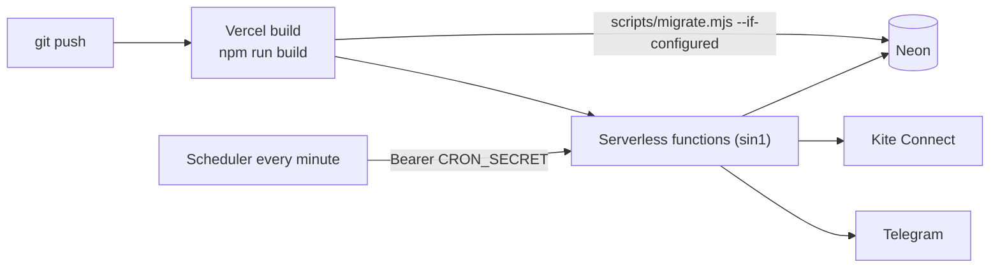

# Deployment

> Related: [setup.md](setup.md) · [database.md](database.md) · [troubleshooting.md](troubleshooting.md)

## 1. Deployment architecture

| Component | Where | Evidence |
| --- | --- | --- |
| Web app + API | **Vercel**, functions pinned to region `sin1` (Singapore) | [vercel.json](../vercel.json) |
| Database | **Neon Postgres** in `ap-southeast-1` (Singapore), pooled connection string | root [README.md](../README.md), [.env.example](../.env.example) |
| Market data | Zerodha Kite Connect (external SaaS) | `src/server/services/kite/` |
| Scheduler | Vercel Cron (Pro plan) **or** an external service such as cron-job.org calling `/api/cron/tick` every minute | root README, [cron route](../src/app/api/cron/tick/route.ts) |
| Alerts out | Telegram Bot API (optional) | `NotificationService.ts` |

**Docker / containers:** none in the repository. **CI/CD:** no pipeline configuration (GitHub Actions etc.) exists.
Deployments are presumably Vercel's Git integration (*inference — not identifiable from the repository*).



---

## 2. Build process

`npm run build` runs, in order:

1. `node scripts/migrate.mjs --if-configured` — applies pending SQL migrations when `DATABASE_URL` is set, and skips
   quietly otherwise.
2. `next build` (Turbopack) — compiles, type-checks and prerenders static pages. API routes are dynamic
   (`force-dynamic`).

Relevant [next.config.ts](../next.config.ts):

- `serverExternalPackages: ['pg', 'kiteconnect']` — loaded from `node_modules` at runtime, not bundled.
- `poweredByHeader: false`.
- Permanent redirects for old URLs: `/library`, `/builder[/:id]`, `/analyzer`, `/strategy/:id`, `/history`,
  `/analytics`.

Function limits: the API catch-all and the cron route set `maxDuration = 300` seconds. Backtests over long ranges
are the main reason. The live-tick lease is 280 s, so it's shorter than that limit.

---

## 3. Environment variables (production)

| Variable | Required | Notes |
| --- | --- | --- |
| `DATABASE_URL` | yes | Neon **pooled** string |
| `KITE_API_KEY` | yes | |
| `KITE_API_SECRET` | yes | Also encrypts the stored Kite token |
| `APP_PASSWORD` | yes | Without it every request returns 503 in production |
| `CRON_SECRET` | yes | e.g. `openssl rand -hex 32`; Vercel Cron sends it automatically as a Bearer token |
| `TELEGRAM_BOT_TOKEN`, `TELEGRAM_CHAT_ID` | no | Server-side alert delivery |
| `RESEND_API_KEY` | no | MCX V2 email alerts (recipients and sender in MCX V2 → Settings) |
| `LOG_LEVEL` | no | Default `info` |
| `KITE_API_ROOT` | no | Kite API base URL override; normally unset |

Never commit real values. `.env*` files are git-ignored.

---

## 4. Kite Connect app

Set the app's **Redirect URL** to `https://<your-domain>/zerodhaRedirection` (`/redirect/zerodha` and
`/api/kite/callback` also work). The historical-data add-on is required for candles.

---

## 5. Scheduler (every minute)

The evaluator must be called **every minute on weekdays** while either market is open:

| Market | Evaluated window (IST) |
| --- | --- |
| NSE/BSE | 09:15 – 15:40 (15:30 close + 10 min grace) |
| MCX | 09:00 – 23:40 (23:30 close + grace) while the US observes daylight saving; 09:00 – 00:05 (23:55 + grace) otherwise |

So the scheduler window must cover **09:00 – 00:05 IST, Monday–Friday**. Calls outside every market window return
`{"ran":false,"reason":"market-closed"}` immediately, so a wider window is harmless.

- **Vercel Pro:**

  ```json
  "crons": [{ "path": "/api/cron/tick", "schedule": "* 3-18 * * 1-5" }]
  ```

  `3-18` UTC covers 08:30–00:29 IST; the day-of-week is evaluated in UTC, and the latest MCX close (00:05 IST) is
  still Friday 18:35 UTC. Hobby plans only allow daily crons, and a more frequent schedule fails the deployment.
- **Any plan:** an external scheduler (e.g. cron-job.org) calling `https://<domain>/api/cron/tick` every minute,
  Mon–Fri, with header `Authorization: Bearer <CRON_SECRET>` (or `?secret=<CRON_SECRET>`).

> ⚠ The root README's older instructions cover only NSE hours (`* 3-10 * * 1-5`). With that window MCX monitors are
> not evaluated in the evening.

---

## 6. Database migrations in deployment

- Migrations run automatically during `npm run build` on Vercel. They're idempotent and forward-only.
- Manual run: `DATABASE_URL=… npm run db:migrate`.
- A new deployment whose code needs a new column applies the migration **before** the new functions go live. Old
  functions still running briefly against the new schema are fine as long as migrations stay additive (the
  project's practice so far).

---

## 7. Rollback considerations

- **Code:** redeploy a previous Vercel deployment (standard Vercel feature; *not configured in the repository*).
- **Schema:** there are no down migrations. Because every migration so far is additive, older code keeps working on
  a newer schema. A destructive migration would need a manual rollback plan.
- **Data written by newer code** (e.g. MCX instruments, MCX configs, `near-month` expiry types) is stored in text
  columns. Older code without MCX support would not understand those rows. Deactivate MCX monitors before rolling
  back past the MCX release.

---

## 8. Post-deploy and daily operations

1. **Each trading day** (tokens reset ~06:00 IST): open the app → **Connect Kite**. The login also re-syncs the
   instrument master for NSE/BSE and MCX.
2. **After the first deploy with MCX support:** click **Settings → Refresh**, or wait for the first tick in market
   hours, so MCX contracts are downloaded. MCX rows are added alongside NSE rows; NSE rows aren't touched.
3. Check **Settings → Live Evaluator** or the top-bar market status. "scheduler idle" means the cron isn't firing.
4. Monitors created before a contract expired roll to the next contract automatically on the next tick.
