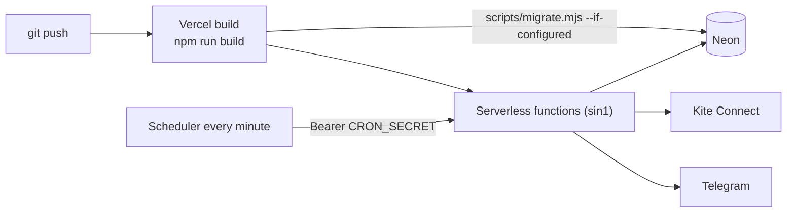

# Deployment

> Related: [setup.md](setup.md) · [database.md](database.md) · [troubleshooting.md](troubleshooting.md)

## 1. Deployment architecture

| Component | Where | Evidence |
| --- | --- | --- |
| Web app + API | **Vercel**, functions pinned to region `sin1` (Singapore) | [vercel.json](../vercel.json) |
| Database | **Neon Postgres** in `ap-southeast-1` (Singapore), pooled connection string | root [README.md](../README.md), [.env.example](../.env.example) |
| Market data | Zerodha Kite Connect (external SaaS) | `src/server/services/kite/` |
| Scheduler | Vercel Cron (Pro plan) **or** an external service such as cron-job.org calling `/api/cron/tick` every minute (the V2 scanner) | [cron route](../src/app/api/cron/tick/route.ts) |
| Live worker | `npm run live` on your own computer (long-running; not on Vercel) | [src/server/workers/v2Live.ts](../src/server/workers/v2Live.ts) |
| Alerts out | Telegram Bot API and Resend email (optional) | [notifications.ts](../src/server/v2/alerts/notifications.ts) |

**Docker / containers:** none in the repository. **CI/CD:** no pipeline configuration (GitHub Actions etc.) exists.
Deployments are presumably Vercel's Git integration (*inference — not identifiable from the repository*).


```mermaid
flowchart LR
  Dev["git push"] --> V["Vercel build<br/>npm run build"]
  V -->|scripts/migrate.mjs --if-configured| DB[("Neon")]
  V --> F["Serverless functions (sin1)"]
  CRON["Scheduler every minute"] -->|Bearer CRON_SECRET| F
  F --> DB
  F --> K["Kite Connect"]
  F --> T["Telegram"]
```

---

## 2. Build process

`npm run build` runs, in order:

1. `node scripts/migrate.mjs --if-configured` — applies pending SQL migrations when `DATABASE_URL` is set, and skips
   quietly otherwise.
2. `next build` (Turbopack) — compiles, type-checks and prerenders static pages. API routes are dynamic
   (`force-dynamic`).

Relevant [next.config.ts](../next.config.ts):

- `serverExternalPackages: ['pg', 'kiteconnect']` — loaded from `node_modules` at runtime, not bundled.
- `poweredByHeader: false`.
- Temporary (307) redirects to `/v2` for `/` and every retired page URL (V1 pages, MCX, MCX V2).

Function limits: the API catch-all and the cron route set `maxDuration = 300` seconds (Compare over many products is
the longest call). The V2 scan lease is 240 s, shorter than that limit.

---

## 3. Environment variables (production)

| Variable | Required | Notes |
| --- | --- | --- |
| `DATABASE_URL` | yes | Neon **pooled** string |
| `KITE_API_KEY` | yes | |
| `KITE_API_SECRET` | yes | Also encrypts the stored Kite token |
| `APP_PASSWORD` | yes | Without it every request returns 503 in production |
| `CRON_SECRET` | yes | e.g. `openssl rand -hex 32`; Vercel Cron sends it automatically as a Bearer token |
| `TELEGRAM_BOT_TOKEN`, `TELEGRAM_CHAT_ID` | no | Server-side alert delivery |
| `RESEND_API_KEY` | no | MCX V2 email alerts (recipients and sender in MCX V2 → Settings) |
| `LOG_LEVEL` | no | Default `info` |
| `KITE_API_ROOT` | no | Kite API base URL override; normally unset |

Never commit real values. `.env*` files are git-ignored.

---

## 4. Kite Connect app

Set the app's **Redirect URL** to `https://<your-domain>/zerodhaRedirection` (`/redirect/zerodha` and
`/api/kite/callback` also work). The historical-data add-on is required for candles.

---

## 5. Scheduler (every minute)

The V2 scanner must be called **every minute on weekdays** while either market is open — NSE/BSE 09:15–15:30 and
MCX 09:00–23:30 (23:55 while the US is on standard time), plus a few minutes' grace — so cover **09:00 – 00:05 IST,
Monday–Friday**. Calls while every market is closed return `skipped: "market-closed"` immediately. While the live
worker is streaming, the scanner only checks the connections the worker can't cover.

- **Vercel Pro:**

  ```json
  "crons": [{ "path": "/api/cron/tick", "schedule": "* 3-18 * * 1-5" }]
  ```

  `3-18` UTC covers 08:30–00:29 IST. Hobby plans only allow daily crons, and a more frequent schedule fails the
  deployment.
- **Any plan:** an external scheduler (e.g. cron-job.org) calling `https://<domain>/api/cron/tick` every minute,
  Mon–Fri, with header `Authorization: Bearer <CRON_SECRET>` (or `?secret=<CRON_SECRET>`).

---

## 6. Database migrations in deployment

- Migrations run automatically during `npm run build` on Vercel. They're idempotent and forward-only.
- Manual run: `DATABASE_URL=… npm run db:migrate`.
- A new deployment whose code needs a new column applies the migration **before** the new functions go live. Old
  functions still running briefly against the new schema are fine as long as migrations stay additive (the
  project's practice so far).

---

## 7. Rollback considerations

- **Code:** redeploy a previous Vercel deployment. Deployments before 2026-09-27 still contain the V1 pages and MCX
  V2; their tables were never dropped, so an older deployment finds its data where it left it (though nothing wrote
  to those tables in between).
- **Schema:** there are no down migrations; every migration so far is additive, so older code keeps working on a
  newer schema.

---

## 8. Daily operations

1. **Each trading day** (tokens reset ~06:00 IST): open the app → **Connect Kite**.
2. Start the live worker on your computer: `npm run live` (it picks up the new login within 30 s). V2 → Dashboard →
   **Live feed** should show LIVE; the top bar shows "Live feed".
3. If the worker isn't running, the top bar shows "Scanner" and the per-minute scanner covers your connections.
