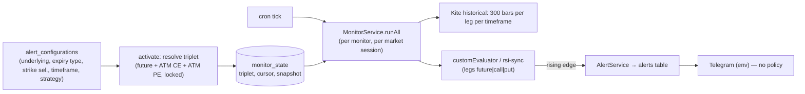
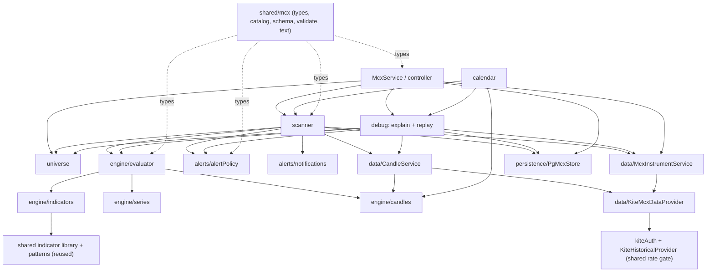
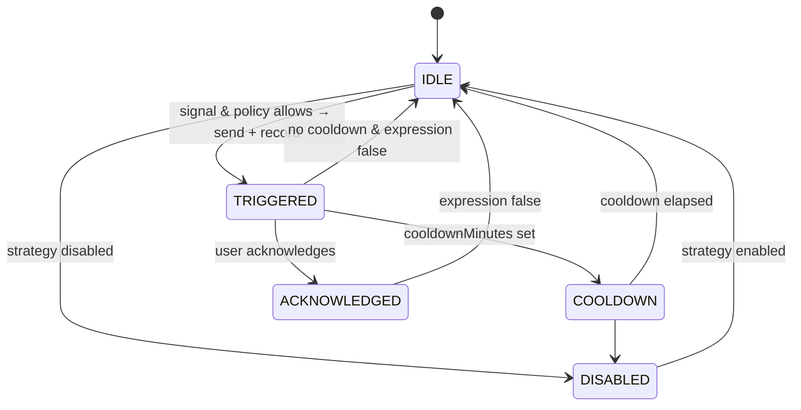

# MCX V2 — discovery, architecture and implementation

Status: **Phases 3–9 implemented (beta at `/mcx-v2`); Phase 10 (migration) not started.** The decisions in
[§ 12](#12-decisions-accepted) were accepted as recommended. V1 (`/mcx`) and NSE/BSE are unchanged. Part A is the
discovery record, Part B the architecture (updated to match what was built) and [Part C](#part-c--implementation-as-built)
the as-built summary, deviations from the proposal and how to verify it.

> Related: [architecture.md](architecture.md) (current system) · [domain.md](domain.md) (current MCX V1 behaviour) ·
> [status.md](status.md)

---

# Part A — Phase 1: discovery

## A1. Current architecture (facts from the repository)

| Concern | What exists today | Where |
| --- | --- | --- |
| Frontend | Next.js 16 App Router, React 19, TanStack Query, Tailwind (CSS-variable themes), rich-tooltip system | `src/app`, `src/client` |
| Backend | Same Next.js app: one catch-all API route → small router → controllers → services. DI container `getContext()` | `src/server/api` |
| Database | Postgres (Neon) via `pg`, raw SQL behind repository interfaces; SQL migrations | `src/server/db`, `db/migrations` |
| Hosting | **Vercel serverless** (`sin1`). No long-running process, no WebSocket | `vercel.json` |
| Scheduler | External per-minute call to `/api/cron/tick` (+ dashboard-driven `POST /api/live/tick`), DB lease `live-tick` | `src/app/api/cron/tick`, `liveTick.ts` |
| Live data | **None streaming.** Candles pulled from Kite historical API on each tick; LTP via `getLTP` for ATM | `KiteHistoricalProvider.ts`, `instrumentSync.ts` |
| Data provider | Kite Connect (`kiteconnect` SDK): instruments, historical (with OI, `continuous` for futures day candles), LTP, login | `src/server/services/kite/` |
| Auth | App password cookie (proxy); `CRON_SECRET`; one app-wide Kite session (encrypted in DB) | `proxy.ts`, `kiteAuth.ts` |
| Config | zod-validated env (`getConfig`) + `app_kv` table | `src/server/config` |
| Logging | JSON-line logger with child components | `src/server/utils/logger.ts` |
| Tests | vitest, 127 tests; real engines + in-memory fakes; no DB/Kite/UI tests | `tests/` |

## A2. Existing MCX implementation (V1) — inventory

A repository-wide search finds MCX logic in **~50 files**. It is not a module; it is a set of branches inside
shared code.

| Layer | Files | What MCX V1 does there |
| --- | --- | --- |
| Registry | `src/shared/constants.ts` | `MCX_PRODUCTS` (13), `segmentOf`, `isMcx`, `underlyingsOf` — MCX products live in the same registry as NSE indices |
| Market rules | `src/shared/strategyMarket.ts` | MCX expiry types, weekly→month mapping, strategy pinning (`marketSegment`, `runsOnSegment`) |
| Sessions | `src/server/utils/marketTime.ts` | `MCX_SESSION` (09:00–23:30/23:55 by US DST), used by NSE code too; no holiday calendar |
| Instruments | `instrumentSync.ts`, `instrumentStore.ts`, `pgStore.replaceExchanges` | MCX rows in the shared `instruments` table; MCX branches in expiry options, strike interval, strike snapping, futures-only triplet |
| Contracts | `instrumentStore.resolveTriplet` | One future + ONE ATM call + ONE ATM put, **locked at activation** |
| Evaluation | `monitorService.ts`, `customEvaluator.ts`, `liveTick.ts` | Same monitor pipeline as NSE; session filtering per underlying; option-leg checks for futures-only |
| Strategy | `runContext.ts`, builder types | Shared JSON strategies; conditions reference legs `future|call|put`; per-condition timeframe/candle relative to the run timeframe |
| Alerts | `alertService.ts`, `alerts` table | Shared table with RSI-specific snapshot columns; no alert policy; every rising edge → alert → Telegram |
| Backtest | `backtestRunner.ts`, `stats.ts` | Session-aware branches |
| API | `mcxController.ts` (`/api/mcx/products`), segment params on instruments/alerts/analytics | |
| UI | `src/client/views/mcx/*` (Hub, Overview, Monitors, shared), plus MCX branches in Dashboard, Configuration, Alerts, FilterBar, StrategyBuilder, Topbar, Settings, MonitorCard, market.tsx | |
| Tests | `tests/mcx.test.ts`, `marketSession.test.ts`, parts of `mtfEvaluator.test.ts` | |

## A3. Current flows (V1)



- **Strategy flow:** a shared JSON strategy (with a market profile) runs in a monitor; conditions name a *leg*, not
  an instrument.
- **Alert flow:** evaluator match → `alertService.record*` → insert (dedupe by config+candle) → notify every
  configured channel. No cooldown, per-strategy channels, acknowledgement or policy.
- **Candles:**
  - Kite native intervals.
  - Weekly aggregated from daily.
  - Heikin Ashi per condition.
  - Larger timeframes read their **forming** candle provisionally.
  - No volume candles; no 2h/4h.
- **Indicators:** streaming classes (RSI, EMA, SMA, VWAP, MACD, BBANDS incl. %B/Bandwidth, Supertrend, Price,
  Volume, OI, ADX, DMI, Pattern) with `peek()` — pure and well-tested.
- **Option handling:** one ATM strike (±2 offsets) per monitor; the strike is locked until the contract expires; no
  multi-strike universes, no ITM/OTM, no CE-only/PE-only targets.
- **Persistence:** configs, monitor state, alerts (shared with NSE); no scanner-run log, no per-condition "why not".
- **UI:** MCX tab (Overview / Monitors / Backtest) built on the shared builder and shared monitor cards.

## A4. What causes the coupling

1. **Instruments are implicit.** Conditions reference `future | call | put` relative to one strike chosen by the
   monitor. You can't express "GOLD FUTURE 15m RSI" *and* "ATM CE 5m Volume" as explicit data contexts, nor
   several strikes.
2. **The universe is split across three places:** monitor config (underlying/expiry/strike), strategy market profile
   (fixed fields), and `monitor_state.triplet` (resolved, locked).
3. **Timeframe is relative.** A condition's timeframe means "override of the run timeframe", and its semantics
   (forming vs closed) depend on whether it's larger or smaller than the run timeframe.
4. **Evaluation, alerting and delivery are one path** (monitor → alert insert → Telegram). There is no alert policy
   layer.
5. **The alert schema is RSI-shaped** (`future_rsi/call_rsi/put_rsi`); custom alerts put arbitrary values there.
6. **Market branches live inside shared services** (`instrumentStore`, `runContext`, `liveTick`, `backtestRunner`,
   builder, filter bar). Every MCX change risks NSE and vice versa.
7. **Weak observability:** only `last_error` per monitor; no scanner-run records, no "why did it not fire".
8. **Sessions are hard-coded;** no holiday / special-session data.

## A5. Reuse / wrap / replace / isolate

| Component | Decision | Reason |
| --- | --- | --- |
| Indicator classes (`library.ts`: RSI, SMA, EMA, BBANDS, ADX, DMI, Volume, OI, Price, …), `RsiCalculator` | **Reuse** via an adapter | Pure, streaming, tested (ADX/DMI checked against a TradingView-style reference) |
| Pattern detectors (`patterns.ts`) | **Reuse** via an adapter | Pure functions over bars |
| `HeikinAshi`, `aggregateWeekly`, `mergeInto` (`candles.ts`) | **Reuse** | Pure |
| `periodOpenMs` / `candleCloseMs` / IST helpers (`marketTime.ts`) | **Reuse** the math, **wrap** in `McxMarketCalendar` | The calendar adds holidays/special sessions from data |
| `KiteAuthService`, `createKiteClient`, `withKiteRetry` | **Reuse** (the Kite session is app-wide) | One broker login for the whole app |
| `KiteHistoricalProvider` request gate (rate limiting, windows) | **Wrap** in `KiteMcxDataProvider` | Kite limits are per API key, so V1 and V2 must not double the request rate |
| Telegram send (`TelegramChannel`) | **Wrap** as a V2 channel | Keep the transport; V2 owns policy and delivery records |
| Logger, DB pool, HTTP router, zod, tooltip system, theme | **Reuse** | Low-level infrastructure |
| Monitor model (`alert_configurations`, `monitor_state`, triplet) | **Replace** (for MCX V2) | Implicit legs + locked strike are the core problem |
| `customEvaluator` leg model, `conditionEngine` cross semantics | **Replace** in V2 | V2 needs explicit series per operand and the brief's cross definition (A6.4) |
| `alerts` table for MCX | **Replace** with MCX V2 tables | Needs policy state, explain JSON, channel records, version reference |
| MCX branches in shared files (A2) | **Isolate now, remove in Phase 10** | V1 keeps running unchanged until V2 is validated |

## A6. Data provider capabilities (verified against Kite Connect v3 docs)

| Brief asks for | Kite provides | Consequence |
| --- | --- | --- |
| Instruments, expiries, strikes, lot/tick size | `getInstruments('MCX')` (daily dump) | ✅ `getExpiryList`, `getStrikeList` are derived from the dump |
| Historical candles | Intervals `minute, 3minute, 5minute, 10minute, 15minute, 30minute, 60minute, day`; OI via `oi=1`; `continuous=1` only for futures **day** candles | ✅ 1m–1h, Daily. **2h / 4h / Weekly must be aggregated** (60m→2h/4h, day→week) |
| Latest quote / LTP | `/quote` (≤ 500 instruments, includes volume, OI, last trade time), `/quote/ltp` and `/quote/ohlc` (≤ 1000) | ✅ One LTP call per cycle can price every underlying future for ATM resolution |
| Option chain | **No endpoint** | Build from the instrument dump + batched quotes |
| IV / Greeks / PCR | **Not provided** | Out of scope. PCR could be computed from quotes' OI later |
| Streaming ticks | Kite WebSocket exists, but **cannot run on Vercel serverless** | "Live candle" evaluation granularity = scheduler cadence (1 min) |
| Expired contracts | No intraday history for expired contracts | Replay works only on currently listed contracts' history |
| Rate limits | Historical **3 req/s**, quote **1 req/s**, others 10 req/s (per API key) | Needs a candle cache + per-cycle request budget (A6.1) |
| Holidays | **No API** | The market calendar must be maintained as data (settings table) |

### A6.1 Capacity arithmetic

At 3 historical requests/s, a 60 s cycle can make at most ~180 requests, shared with NSE monitors and backtests.
Refetching every series every minute doesn't scale to option universes (e.g. 10 strategies × ATM±5 CE+PE = 220
series). V2 therefore:

- fetches a series only when it has a **newly completed candle** (completed-candle mode), or every cycle for
  live-candle strategies;
- caches candles so each fetch is incremental (a few candles, one request);
- shares identical series across strategies within a cycle;
- enforces a per-cycle request budget and per-strategy universe caps ([§ 12](#12-decisions-accepted)).

### A6.2 Behaviours that differ from V1 (by design, per the brief)

| Topic | V1 | V2 (brief) |
| --- | --- | --- |
| `CROSSED_ABOVE` | `prev < level && curr ≥ level` | `prev ≤ level && curr > level` |
| Larger-timeframe operands | Forming candle, read provisionally | Evaluation mode applies to **every** series: completed mode reads each series' last completed candle; live mode reads forming candles |
| Strike | Locked at activation | Resolved dynamically every cycle (never stored when dynamic) |
| Alert trigger | Every rising edge | Alert policy (transition / repeat, cooldown, once per candle, channels) |

---

# Part B — Phase 2: architecture proposal

## 1. Principles

- **Modular monolith, not microservices.** MCX V2 lives inside the same Next.js app behind an explicit module
  boundary: `src/server/mcx/**` (server) and `src/client/mcx/**` (UI).
- **Layers never skip or mix:** MARKET → UNIVERSE → SELECTION → DATA SERIES → CANDLES → INDICATORS → CONDITION →
  EXPRESSION → STRATEGY → SIGNAL → ALERT POLICY → DELIVERY.
- **Everything is explicit in the stored JSON:** each operand carries its full series context. The UI may offer
  "same as left side", but it always persists the full context. There are no hidden defaults.
- **Boundary enforced by a test:** a vitest test scans imports and fails if `src/server/mcx/**` imports V1 business
  modules (`live/*`, `strategy/*`, `kite/instrumentStore`, `kite/instrumentSync`, `shared/strategyMarket`), or if
  V1 imports V2. Only whitelisted low-level utilities may be shared.

## 2. Module map

As built (the proposal's finer split into `conditions/`, `expression/`, `signals/`… was folded into fewer files):

```
src/shared/mcx/                  Shared by server and UI (imports nothing but zod)
├── types.ts                     Domain model: instrument, universe, series, operand, expression, strategy, unit
│                                state, signal, alert, scan run, settings, calendar
├── catalog.ts                   Products, timeframes (native / derived), candle types, operators, indicators
│                                (params, sources, outputs, units, history), patterns, expiry / strike modes
├── schema.ts                    zod schemas (strategy definition, universe, settings, calendar)
├── validate.ts                  validateStrategy — semantic rules shared by editor and server
└── text.ts                      Human-readable universe / series / condition / policy text and the IF/THEN preview

src/server/mcx/
├── calendar/McxMarketCalendar   Sessions (US-DST close), holidays + special sessions, candle boundaries, trigger clock
├── universe/UniverseResolver    Expiry + strike selectors (ATM ± N, ITM/OTM, specific, range, all), CE/PE, reference future
├── data/                        McxDataProvider (interface) · KiteMcxDataProvider · McxInstrumentService (mcx_instruments)
│                                · CandleService (per-cycle fetch-once store + request budget)
├── engine/                      candles (derived timeframes, Heikin Ashi, volume candles) · indicators (adapters over the
│                                shared indicator library + patterns) · series (role → instrument, keys) · evaluator
│                                (alignment, operators, three-valued AND/OR/NOT, traces, data-readiness wait)
├── alerts/                      alertPolicy (pure state machine, signal identity) · notifications (Telegram, Resend
│                                email, delivery records, message formatting)
├── scanner/McxScanner           The 11-stage cycle, failure isolation, scan-run records
├── debug/dryRun                 Explain (why it would / wouldn't fire, now) and replay (past candles)
├── persistence/                 McxStore interface · PgMcxStore (mcx_* tables)
├── McxService.ts                Application service used by the API controller
└── index.ts                     createMcxModule() — wired into the API context

src/server/api/controllers/mcxV2Controller.ts   /api/mcx/v2/* handlers
src/client/mcx/                  UI (see § 10)
```

**Dependencies between sub-modules** (arrows = "uses"; nothing points upward):



## 3. Domain models (the proposal; the shipped types are in `src/shared/mcx/types.ts`)

```ts
// ---- Instruments ---------------------------------------------------------
type McxInstrumentType = 'MCX_FUTURE' | 'MCX_OPTION' | 'MCX_INDEX'; // INDEX only if present in the Kite dump
type OptionType = 'CE' | 'PE';

interface McxInstrument {
  id: string;              // `MCX:<token>`
  token: number;
  exchange: 'MCX';
  instrumentType: McxInstrumentType;
  underlying: string;      // product symbol, e.g. GOLD
  symbol: string;          // Kite tradingsymbol, e.g. GOLD26OCT75000CE
  expiry: string | null;   // yyyy-mm-dd
  strike: number | null;
  optionType: OptionType | null;
  lotSize: number;
  tickSize: number;
  active: boolean;         // present in the latest dump and not expired
}

// ---- Universe (explicit, per strategy) -----------------------------------
type ExpirySelector = { mode: 'CURRENT' | 'NEXT' | 'FAR' | 'ALL' } | { mode: 'SPECIFIC'; date: string };

type StrikeSelector =
  | { mode: 'ATM_OFFSETS'; offsets: number[] }          // [0] = ATM, [-2,-1,0,1,2] = ATM±2
  | { mode: 'ITM'; count: number }                       // N strikes in the money (per CE/PE)
  | { mode: 'OTM'; count: number }                       // N strikes out of the money
  | { mode: 'SPECIFIC'; strikes: number[] }
  | { mode: 'RANGE'; from: number; to: number }
  | { mode: 'ALL' };

type TargetSpec =
  | { kind: 'FUTURE'; expiry: ExpirySelector }
  | { kind: 'OPTION'; expiry: ExpirySelector; optionTypes: OptionType[]; strikes: StrikeSelector };

interface Universe {
  underlying: string;                     // GOLD
  // Which future is "UNDERLYING" (ATM is computed from its LTP). Default MATCH_TARGET = the future the
  // selected option expiry devolves into (e.g. Gold options → the next bi-monthly future), so ATM is correct.
  reference: { expiry: ExpirySelector | { mode: 'MATCH_TARGET' } };
  target: TargetSpec;                     // what the strategy produces signals for
}

// Operands address instruments by ROLE — never by a stored dynamic strike.
type InstrumentRef =
  | { role: 'UNDERLYING' }                 // the reference future
  | { role: 'TARGET' }                     // the target instrument being evaluated
  | { role: 'FIXED'; instrumentId: string }; // an explicitly chosen contract

// ---- Data series ----------------------------------------------------------
type Timeframe = '1m' | '3m' | '5m' | '10m' | '15m' | '30m' | '1h' | '2h' | '4h' | '1d' | '1w';
type CandleSpec = { type: 'NORMAL' } | { type: 'HEIKIN_ASHI' } | { type: 'VOLUME'; volumePerCandle: number };

interface SeriesSpec { instrument: InstrumentRef; timeframe: Timeframe; candle: CandleSpec }

// ---- Operands, conditions, expression ------------------------------------
type PriceField = 'open' | 'high' | 'low' | 'close';
type Source = PriceField | 'volume' | 'oi';

type Operand =
  | { kind: 'CONSTANT'; value: number }
  | { kind: 'FIELD'; series: SeriesSpec; field: Source }                        // CLOSE, VOLUME, OI
  | { kind: 'OI_CHANGE'; series: SeriesSpec; lookback: number }
  | { kind: 'INDICATOR'; series: SeriesSpec; indicator: string; params: Record<string, number>;
      source?: Source; output?: string; multiplier?: number };                 // e.g. 2 × SMA(volume, 20)

type Operator = 'GT' | 'LT' | 'GTE' | 'LTE' | 'EQ' | 'CROSSED_ABOVE' | 'CROSSED_BELOW';

type ExprNode =
  | { type: 'AND' | 'OR'; id: string; label?: string; children: ExprNode[] }
  | { type: 'NOT'; id: string; child: ExprNode }
  | { type: 'CONDITION'; id: string; left: Operand; operator: Operator; right: Operand }
  | { type: 'PATTERN'; id: string; series: SeriesSpec; pattern: PatternId };

// ---- Strategy + alert policy ---------------------------------------------
interface Evaluation {
  mode: 'COMPLETED_CANDLE' | 'LIVE_CANDLE';   // default COMPLETED_CANDLE
  triggerTimeframe: Timeframe;                // the clock; default = smallest timeframe in the expression
}

interface AlertPolicy {
  channels: { telegram: boolean; email: boolean };
  trigger: 'ON_TRANSITION' | 'WHILE_TRUE';    // ON_TRANSITION = first false→true; WHILE_TRUE = "repeat"
  cooldownMinutes: number | null;
  oncePerCandle: boolean;
}

interface McxStrategyDefinition {             // stored per version, immutable once saved
  schemaVersion: 1;
  market: 'MCX';
  name: string;
  universe: Universe;
  evaluation: Evaluation;
  expression: ExprNode;
  alert: AlertPolicy;
}
```

**Worked example — the Definition-of-Done strategy #1:**

```json
{
  "schemaVersion": 1, "market": "MCX", "name": "Gold Momentum",
  "universe": {
    "underlying": "GOLD",
    "reference": { "expiry": { "mode": "MATCH_TARGET" } },
    "target": { "kind": "OPTION", "expiry": { "mode": "CURRENT" }, "optionTypes": ["CE"],
                "strikes": { "mode": "ATM_OFFSETS", "offsets": [-2, -1, 0, 1, 2] } }
  },
  "evaluation": { "mode": "COMPLETED_CANDLE", "triggerTimeframe": "15m" },
  "expression": { "type": "AND", "id": "root", "children": [
    { "type": "CONDITION", "id": "c1",
      "left":  { "kind": "INDICATOR", "series": { "instrument": { "role": "TARGET" }, "timeframe": "15m", "candle": { "type": "NORMAL" } },
                 "indicator": "RSI", "params": { "period": 14 }, "source": "close" },
      "operator": "CROSSED_ABOVE", "right": { "kind": "CONSTANT", "value": 60 } },
    { "type": "CONDITION", "id": "c2",
      "left":  { "kind": "INDICATOR", "series": { "instrument": { "role": "TARGET" }, "timeframe": "15m", "candle": { "type": "NORMAL" } },
                 "indicator": "ADX", "params": { "period": 14, "smoothing": 14 } },
      "operator": "GT", "right": { "kind": "CONSTANT", "value": 25 } },
    { "type": "CONDITION", "id": "c3",
      "left":  { "kind": "FIELD", "series": { "instrument": { "role": "TARGET" }, "timeframe": "15m", "candle": { "type": "NORMAL" } }, "field": "close" },
      "operator": "CROSSED_ABOVE",
      "right": { "kind": "INDICATOR", "series": { "instrument": { "role": "TARGET" }, "timeframe": "15m", "candle": { "type": "NORMAL" } },
                 "indicator": "SMA", "params": { "period": 20 }, "source": "close" } }
  ]},
  "alert": { "channels": { "telegram": true, "email": true }, "trigger": "ON_TRANSITION", "cooldownMinutes": 30, "oncePerCandle": true }
}
```

DoD strategy #2 (SILVER, PE, specific expiry, OTM, 5m Heikin Ashi, `Volume > SMA(volume,20)` AND Hammer) uses its
own universe and series. Nothing is shared except cached data that happens to be identical.

## 4. Evaluation semantics (the contract the tests will encode)

1. **Evaluation unit** = (strategy version × target instrument). A GOLD ATM±2 CE strategy has 5 units, each with
   its own state and signals. `UNDERLYING` operands are shared by all units; `TARGET` operands are per unit.
2. **Clock:**
   - *Completed mode:* a unit is evaluated **once** when its trigger series (`triggerTimeframe`, on the target)
     has a newly completed candle since the unit's `last_evaluated_candle`.
   - *Live mode:* evaluated every scanner cycle on the forming candle.
3. **Series alignment:** at evaluation time *T* (the trigger candle's close; "now" in live mode), every other series
   uses its latest candle that closed at or before *T* (completed mode), or its forming candle (live mode). There's
   no look-ahead: a slower candle is used only after it closes.
4. **Operators:** `GT/LT/GTE/LTE/EQ` compare current values.
   - `CROSSED_ABOVE` = `left.prev ≤ right.prev && left.curr > right.curr`; `CROSSED_BELOW` mirrors it. `prev`/`curr`
     are the operand's own series' previous and current candles. A constant has prev = curr.
   - A cross on a slower series stays true until that series gets a new candle (Chartink-like). The transition
     policy prevents repeated alerts.
5. **Insufficient data** (warm-up, missing candle) → the condition is `UNKNOWN`, which propagates through the
   expression (three-valued logic) and never alerts; the explain output shows e.g. "not enough history (9 candles,
   needs ~15)". It is never silently true or false.
6. **Expression:** AND/OR short-circuit only for the result; every condition is still evaluated for the explain
   trace. NOT inverts its child; an UNKNOWN child stays UNKNOWN.
7. **Signal:** produced when the expression is `true` and the policy trigger allows it (`ON_TRANSITION`: previous
   unit result was `FALSE` — `UNKNOWN` doesn't count). **Signal identity** =
   `strategyId · version · targetInstrumentId · triggerTimeframe · triggerCandleTime · signalType` — a unique index
   in `mcx_signals`, so a candle can never produce two signals, no matter how often the scanner runs.

## 5. Alert policy and state machine



- **Per unit**, persisted in `mcx_unit_state`: `state`, `last_evaluated_candle`, `last_result`,
  `last_signal_candle`, `last_alert_at`, `cooldown_until`.
- **Checks in order:** strategy enabled → signal identity new → once-per-candle → cooldown → trigger mode → send to
  enabled channels → record the alert and each delivery (`sent`/`failed` + error) → transition state.
- A failed channel doesn't block other channels. Retrying failed deliveries is out of scope for the first version
  (it is recorded).

## 6. Scanner pipeline

Runs inside the existing per-minute cron call as an **isolated second job** (own lease `mcx-v2-scan`, own
try/catch, own time budget). A V2 failure can't affect NSE or MCX V1, and vice versa.

| Stage | Work | Isolation |
| --- | --- | --- |
| 1 | Calendar: is MCX open (session, holiday, special session)? | — |
| 2 | Load enabled strategies (current versions) | Invalid strategy → error record, skipped |
| 3 | Resolve universes: expiry selection → reference future (`MATCH_TARGET` = the future the option expiry devolves into) → batched LTP (1 quote call) → strike selection → target instruments | Per strategy |
| 4 | Build the dependency graph: unique (instrument, native interval) fetch requirements, then derived series (aggregation, HA, volume candles), then indicator instances | — |
| 5 | Fetch due series (new completed candle or live mode) through the budgeted, cached provider | Per series: failure → error record, dependents UNKNOWN |
| 6 | Build candles (aggregate / HA / volume) — memoized per cycle | Per series |
| 7 | Indicators — one instance per (series, indicator, params, source, output), memoized | Per indicator |
| 8 | Conditions + expression per evaluation unit | Per unit |
| 9 | Signals (identity, transition) | Per unit |
| 10 | Alert policy → notifications | Per alert / per channel |
| 11 | Persist state, signals, alerts, scan-run summary + errors | Per run |

Cache keys: candles `token · interval · candleTime`; derived series
`instrumentId · timeframe · candleSpec · dataVersion(last candle time)`; indicators
`seriesKey · indicator · params · source · output`.

**Scan-run record** (logged and persisted):

```
MCX SCANNER  cycle 21:15:00  strategies 3 (1 skipped: invalid)
universe 24 instruments · series 30 due / 48 total · requests 30 (budget 120)
conditions 72 evaluated · signals 1 · alerts 1 (telegram ✓ email ✓) · errors 1 (GOLD 75100 CE 15m: fetch failed)
```

## 7. Data layer

```ts
interface McxDataProvider {
  isConnected(): Promise<boolean>;
  getInstruments(): Promise<McxInstrument[]>;                              // Kite MCX dump → FUT / CE / PE of the 13 products
  getHistoricalCandles(q: { instrument; interval: NativeInterval; from; to }): Promise<RawCandle[]>;
  getLtp(instruments): Promise<Map<token, number>>;                        // batched ≤ 1000 per call
  getQuotes(instruments): Promise<Map<token, { ltp; volume; oi; change }>>; // batched ≤ 500 per call
}
```

- **`KiteMcxDataProvider`** goes through the app's single `KiteHistoricalProvider`, so V1 and V2 share one
  historical rate gate (~3 req/s). `continuous=1` is used only for futures day candles.
- **No candle cache table** (deviation from the proposal's `mcx_candles`). Kite limits the *number* of requests, not
  their size, so a cache saves nothing per request while adding staleness risk. Instead `CandleService` fetches
  each (instrument, native interval) **at most once per cycle** over a fixed look-back (`LOOKBACK_DAYS`: 4 days of
  1m … 125 days of 1h … 1000 days of daily — ≥ ~300 candles of every timeframe built from them), shares it with
  every unit and strategy reading that instrument, and builds each series once.
- **The trigger clock avoids fetching at all** when nothing is due: completed-candle units that already evaluated
  the latest trigger candle cost zero candle requests. The only per-minute request is one batched LTP call when a
  strategy uses ATM-relative strikes.
- **Request budget** (`Settings → Requests / cycle`, default 150): units whose fetches don't fit are deferred to the
  next cycle and reported.
- **Derived series:** `2h`/`4h` from 1h aligned to the 09:00 open (last candle truncated at the close); `1w` from
  daily (Monday start, closes on the week's last trading day); Heikin Ashi from normal candles; volume candles from
  the series' own timeframe candles, closing when cumulative volume ≥ N and **restarting every trading day** so
  boundaries don't depend on the fetch window.

## 8. Market calendar

`McxMarketCalendar` provides `isTradingDay(date)`, `sessionStart(date)`, `sessionEnd(date)`,
`isMarketOpen(now)` and `candleClose(open, tf)`. Defaults: weekdays 09:00 to 23:30/23:55 (US-DST rule reused from
`marketTime.ts`). Overrides come from `mcx_calendar` rows (`HOLIDAY`, `SPECIAL_SESSION` with custom open/close),
edited in **MCX V2 → Settings → Market calendar**. There are no timestamps scattered through the code.
`lastCompletedOpen(now, tf)` is the trigger clock: the open of the last candle that has closed by `now`.

## 9. Persistence model

Additive migration `006_mcx_v2.sql`; no V1 table is touched.

| Table | Key columns | Purpose |
| --- | --- | --- |
| `mcx_instruments` | `token` PK · instrument_type · underlying · symbol · expiry · strike · option_type · lot/tick · active · synced_at | V2's own instrument universe (re-synced when older than 18 h) |
| `mcx_calendar` | `date` PK · kind · open_min · close_min · note | Holidays / special sessions |
| `mcx_strategies` | `id` PK · name · enabled · enabled_at · current_version · created/updated | Strategy header (`enabled_at` = the "never alert on older candles" floor) |
| `mcx_strategy_versions` | (`strategy_id`, `version`) PK · definition jsonb · created_at | Immutable definitions; signals/alerts reference a version |
| `mcx_unit_state` | (`strategy_id`, `target_instrument_id`) PK · state · last_evaluated_candle · last_result · last_signal_candle · last_alert_at · cooldown_until · last_evaluation jsonb | Per-unit state machine + the latest evaluation (explain) |
| `mcx_signals` | `id` · identity UNIQUE · strategy_id · version · target_instrument_id · trigger_timeframe · candle_time · signal_type · outcome · evaluation jsonb | Every signal (delivered or suppressed, with the reason); the unique identity is the dedupe |
| `mcx_alerts` | `id` · signal_id FK · strategy_name · version · status · instrument jsonb · trigger_timeframe · candle_time · price · evaluation jsonb · acknowledged_at | Alert history with the full "why" |
| `mcx_deliveries` | `id` · alert_id FK · channel · status · error · sent_at | Per-channel outcomes |
| `mcx_scan_runs` | `id` · started/finished · status · summary jsonb (counts, budget, notes, errors) | Scanner observability (pruned after 3 days) |
| `mcx_scan_errors` | `id` · run_id FK · strategy_id · instrument_id · condition_id · timeframe · source · message | Error attribution |
| `mcx_settings` | `key` PK · value jsonb | Telegram chat override, email recipients / sender, caps |

The proposal's `mcx_alert_state` was named `mcx_unit_state`; `mcx_candles` was dropped (see § 7). The scanner lease
reuses the shared `app_locks` table with its own name (`mcx-v2-scan`).

## 10. API and UI

**API** under `/api/mcx/v2/` (full list in [api.md](api.md#412-mcx-v2-beta)):

| Area | Routes |
| --- | --- |
| Status | `GET /status` — market session, Kite, instrument master, strategies, last scan, channel setup |
| Instruments | `GET /products` · `GET /instruments` (filters) · `POST /instruments/sync` |
| Universe | `POST /universe/preview` — resolves a universe now, with ATM, notes and live quotes |
| Strategies | `GET/POST /strategies` · `GET/PUT/DELETE /strategies/:id` · `/duplicate` · `/enable` · `/disable` · `/versions` · `/units` · `POST /validate` |
| Explain | `POST /strategies/:id/explain` (saved) · `POST /explain` (unsaved draft) |
| Replay | `POST /replay` — saved strategy or draft, date range, optional contracts |
| Alerts | `GET /alerts` (`?active=1`) · `GET /alerts/:id` · `POST /alerts/:id/acknowledge` · `GET /signals` |
| Ops | `POST /scan` · `GET /scan-runs` · `GET /scan-runs/:id` · `GET/PUT /settings` · `GET/PUT /calendar` · `GET /channels` · `POST /channels/test` |

**UI** at `/mcx-v2` (sidebar "MCX V2 · beta"), existing visual style, every control with a rich tooltip
(`src/client/mcx/help.ts`):

```
src/client/mcx/
├── McxV2Hub.tsx        Tabs (URL ?tab=): Dashboard · Strategies · Alerts · Scanner · Instruments · Settings;
│                       asks the server to scan once a minute while open during market hours
├── DashboardTab        Market / Kite / instruments / strategies / last scan, channel status, active alerts, Scan now
├── StrategiesTab       List (enable / disable, explain now, edit, duplicate, delete, contracts & state) + examples
├── editor/             StrategyEditor (1 What & where → 2 When → 3 Conditions → 4 Alert, with Preview, Validation,
│                       Test now, Replay) · UniverseEditor + ResolvedInstruments · ExpressionEditor (AND/OR groups,
│                       NOT, reorder) · OperandEditor + SeriesPicker · DebugViews (ExplainView, ReplayView)
├── AlertsTab           Active (acknowledge) · History · Signals (incl. suppressed); expand = why it fired
├── ScannerTab          Scan runs with counts, requests vs budget, notes and errors
├── InstrumentsTab      Sync, products with expiries / strike counts, contract search
├── SettingsTab         Telegram / email destinations with test buttons, caps, market calendar
└── api.ts · components.tsx · format.ts · help.ts
```

The editor follows WHAT → WHERE → WHEN → CONDITION → ALERT; HOW (indicator/params) lives inside each condition. A
condition always reads with its full context, e.g. `[GOLD ATM ± 2 CE] [15 min] [Normal] RSI(14) crossed above 60`.

**Validation** (`validateStrategy`, shared by UI and server; blocks enabling):

- Missing instrument, timeframe or indicator params.
- Invalid strike selection; option expiry unavailable.
- Unsupported timeframe or candle type.
- Insufficient history for an indicator.
- Incompatible operand units (price vs oscillator).
- Volume/OI on a series without volume/OI.
- Cross conditions without a previous candle.
- An empty expression.
- Alert channels enabled without a configured destination.
- A universe above the cap.

## 11. Testing plan (per phase)

| Area | Tests |
| --- | --- |
| Indicators | RSI, SMA (incl. `source=volume`), Bollinger, ADX, DMI vs reference series (reusing existing references) |
| Candles | Normal passthrough, Heikin Ashi, 2h/4h/weekly aggregation alignment, volume candles |
| Operators | GT/LT/GTE/LTE/EQ; `CROSSED_ABOVE` = `prev ≤ t < curr` (incl. equality edges); `CROSSED_BELOW` |
| Expression | AND, OR, NOT, nested groups, UNKNOWN propagation |
| Universe | CURRENT/NEXT/FAR/SPECIFIC/ALL expiries; ATM, ATM±N, ITM/OTM for CE and PE, specific, range, all; dynamic ATM shift |
| Alerts | Identity dedupe, once per candle, cooldown, repeat (WHILE_TRUE), state transitions, channel failure isolation; Telegram/Email with fake transports |
| Scanner | One instrument fails → others continue; one strategy fails → others continue; request budget; completed candle evaluated exactly once |
| Boundary | Import-rule test (no V1 ↔ V2 business imports) |
| DoD | End-to-end fixtures for both Definition-of-Done strategies: expected instruments, exactly one signal, alert recorded, explain trace |

## 12. Decisions (accepted)

All nine were accepted as recommended ("go with recommendations"). As built: D2 builds volume candles from the
series' own timeframe candles (1m when the series is 1m) and restarts them daily.

| # | Decision | Recommendation (accepted) |
| --- | --- | --- |
| D1 | **Email provider** (DoD requires email; earlier you deferred email) | Resend HTTP API — no new dependency, works on Vercel; env `RESEND_API_KEY` + recipients in MCX settings. Alternative: SMTP via `nodemailer` |
| D2 | **Volume candles** (earlier deferred) | Build from 1-minute candles: each candle closes when cumulative volume ≥ N. Kite has no ticks, so boundaries are at 1-minute granularity; label as such |
| D3 | **Cross semantics differ from V1** (`prev ≤ t < curr` vs V1 `prev < t ≤ curr`) | Use the brief's definition in V2; leave V1 unchanged |
| D4 | **Universe caps** (Kite 3 req/s) | ≤ 40 target instruments per strategy, ≤ 150 historical requests per cycle; show the resolved count and the cap in the UI |
| D5 | **Scheduler** | Same cron call, isolated second job with its own lease (no extra cron to configure). A dedicated `/api/cron/mcx-v2` endpoint is the alternative |
| D6 | **Holiday calendar** | Manually maintained in MCX V2 → Settings (no provider API); pre-fill the current year's MCX list on request |
| D7 | **Live-candle granularity** | Evaluated once per scheduler cycle (1 minute) — the platform has no tick stream on Vercel |
| D8 | **Navigation** | Keep the current pages; add "MCX V2 (beta)" at `/mcx-v2` until migration, then it replaces `/mcx` (no NSE/BSE re-grouping now) |
| D9 | **Telegram destination** | Reuse the existing bot env vars; allow a per-MCX chat id override in settings |

## 13. Delivery plan

| Phase | Output | Exit check | Status |
| --- | --- | --- | --- |
| 3 Core domain | `shared/mcx`, `universe/`, `calendar/`, validation, zod schema, migration 006 | Unit tests for universe, calendar, validation; boundary test | ✅ done |
| 4 Data engine | `KiteMcxDataProvider`, `CandleService`, instrument sync, request budget | Fixture tests; one live read-only sync + fetch against Kite | ✅ code + fixture tests · ⏳ live Kite check pending |
| 5 Indicators | Adapters + `source` support, derived timeframes, HA, volume candles | Candle / indicator tests | ✅ done |
| 6 Strategy engine | Conditions, crosses, multi-timeframe, completed/live modes, explain | Operator/expression/series-alignment tests | ✅ done |
| 7 Alert engine | Signals, policy, state machine, Telegram + Email, history | Dedupe/cooldown/once-per-candle tests | ✅ done (fake transports) · ⏳ real Telegram/Resend send pending |
| 8 UI | MCX V2 section at `/mcx-v2` | Walkthrough of both DoD strategies | ✅ built · checked locally without Kite |
| 9 Debugging | Explain, replay, scan-run views | Explain output matches evaluation | ✅ done |
| 10 Migration | Side-by-side run → V2 primary at `/mcx` → V1 MCX monitors disabled → V1 MCX branches removed | Validation checklist below | not started |

V1 keeps running untouched throughout Phases 3–9.


---

# Part C — Implementation (as built)

## C1. Semantics the code and tests enforce

- **Evaluation unit** = strategy version × target contract. Operands address instruments by role (`TARGET`,
  `UNDERLYING` = reference future, `FIXED`); dynamic strikes are re-resolved every cycle and never stored.
- **Clock.** Completed-candle mode evaluates a unit once per trigger candle, at T = that candle's close; every series
  reads its last candle **completed by T** (a 1h series on a 15m trigger uses the last closed hour, so a 1h cross stays
  true until the next hour closes). Live mode uses T = now and forming candles, every minute.
- **Data readiness.** If a trigger-timeframe series doesn't have the just-closed candle yet, the unit waits up to
  3 minutes (vendor lag), then evaluates without it (illiquid contracts may have no trade in a candle).
- **Crosses:** `CROSSED_ABOVE` = previous left ≤ previous right **and** current left > current right (equality within
  a relative epsilon of 1e-9). `EQ` uses the same epsilon.
- **Three-valued logic:** missing data → `UNKNOWN` with a reason; `AND`/`OR`/`NOT` propagate it; `UNKNOWN` never
  alerts and never counts as "false" for a transition.
- **Previous result** for `ON_TRANSITION`: the stored result when the unit evaluated exactly the previous trigger
  candle; otherwise (first run, gap, a strike newly inside ATM ± N) it is re-evaluated on the previous candle.
- **Alert policy** (pure, `alertPolicy.ts`): identity = `strategy:v<version>:<target>:<tf>:<candle>:ENTRY`
  (+ `:m<minute>` for live mode without once-per-candle); outcomes `ALERTED`, `NO_CHANNEL`, `SUPPRESSED_COOLDOWN`,
  `SUPPRESSED_ACKNOWLEDGED`, `SUPPRESSED_BEFORE_ENABLE` (T before `enabled_at`), `SUPPRESSED_STALE` (T more than
  30 min ago). Signals are inserted before delivery; a duplicate identity (retry, lost state, concurrent run) is
  dropped, so a candle is alerted at most once.
- **Isolation.** V2 runs in the same cron call as V1 but in its own `try/catch` with its own lease; a strategy /
  unit / series / channel failure is recorded in the scan run and never stops the rest.

## C2. Verification

- `npm test` — 57 MCX V2 tests in `tests/mcx2/` (calendar, universe, candles, evaluator, alert policy, validation,
  scanner end-to-end, module boundary) on top of the existing suite. The scanner tests run **both Definition-of-Done
  strategies side by side** on fixture data: strategy #1 alerts exactly one of the five GOLD ATM ± 2 CE strikes on
  Telegram + Email with a 30-minute cooldown; strategy #2 independently alerts one SILVER OTM PE on 5-minute Heikin
  Ashi candles; re-runs, lost state, pre-enable candles, a failing series, a failing channel, the budget and the
  lease are covered, as are explain and replay.
- Checked locally against a throwaway database (no Kite): every tab renders in light and dark themes; creating,
  validating and enabling strategies works; enabling is refused while a chosen channel isn't configured; a scan
  without Kite records a FAILED cycle with the reason.

## C3. Before relying on it

1. Run migration 006 on the production database (`npm run db:migrate`, or the next Vercel build runs it).
2. Log in to Kite, open **MCX V2 → Instruments → Sync from Kite**, then check a strategy's **Resolved instruments**
   (ATM from the live future price) and **Explain now** during market hours.
3. Configure channels: `TELEGRAM_BOT_TOKEN` (+ `TELEGRAM_CHAT_ID` or the MCX chat override) and, for email,
   `RESEND_API_KEY` + recipients and a verified sender in **MCX V2 → Settings**; use the test buttons.
4. Enter this year's MCX holidays in **Settings → Market calendar**.
5. Run V2 side by side with V1 before starting Phase 10.

## C4. Known limits

- Kite has no ticks on Vercel: live mode and volume-candle boundaries have 1-minute granularity at best.
- Replay uses today's targets (current ATM) unless contracts are chosen; live-candle strategies are replayed on
  completed candles.
- Kite serves no intraday data for expired contracts, so replay can't go back past a contract's life.
- Missed trigger candles (scanner down, budget) are not back-filled; the next evaluation seeds its previous result.
